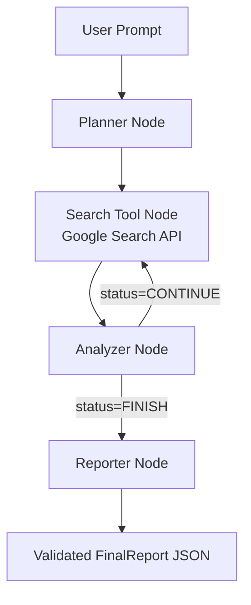

# Sentinel Research Agent (SRA)

## 1. Project Overview
- **Goal**: Convert natural-language research requests into validated, multi-section reports that a downstream system can parse reliably.
- **Approach**: LangGraph orchestrates a ReAct-style workflow across planner → search → analyzer loops, Pydantic V2 enforces schemas for tool inputs and the final deliverable, and OpenRouter-hosted Gemini (via LangChain) performs planning and synthesis while calling the Google Search API for fresh data.
- **Key Requirements**: Deterministic structure, iterative reasoning with conditional routing, external search integration, and a final report that carries citations plus an executive summary.

## 2. System Architecture
| Component | Technology | Role | Rationale |
| --- | --- | --- | --- |
| Orchestrator | LangGraph | Defines the state machine and directed edges handling the planner/search/analyzer loop. | Supports conditional routing, memoryful loops, and typed state via `TypedDict`. |
| State Object | `TypedDict` | Shared memory containing messages, current query, search results, and status. | Lightweight, compatible with LangGraph state management. |
| LLM | Gemini via OpenRouter + LangChain | Handles reasoning, planning, summarization, and structured output. | Strong tool-calling support and structured output; OpenRouter simplifies model swaps. |
| Validation | Pydantic V2 | Enforces schemas for tool inputs (`SearchInput`) and the final report (`FinalReport`). | Guarantees JSON compatibility, predictable downstream parsing. |
| Tool | Google Search API | Provides real-time search results. | Supplies up-to-date evidence for reports. |
| Export | (Future) Sheets connector | Optional post-processing step to push validated reports into Google Sheets. | Enables tracking and automation. |

## 3. Agent State Definition
```python
class AgentState(TypedDict, total=False):
    messages: Annotated[List[BaseMessage], operator.add]  # Chat history
    research_query: str                                   # Focused search query
    search_results: Annotated[List[SearchHit], operator.add]  # Normalized search hits
    status: Literal["CONTINUE", "FINISH"]                 # Router flag
    final_report: FinalReport | None                      # Reporter output
```

## 4. Pydantic Schemas

### 4.1 Tool Input Schema (`SearchInput`)
```python
from pydantic import BaseModel, Field

class SearchInput(BaseModel):
    """Arguments passed into the Google Search API tool."""
    query: str = Field(description="Well-formed search query.")
    num_results: int = Field(default=5, ge=1, le=10, description="Number of search hits to fetch.")
    freshness: str | None = Field(default=None, description="Optional time filter, e.g., 'd7' for last 7 days.")
```

### 4.2 Final Output Schema (`FinalReport`)
```python
from pydantic import BaseModel, Field
from typing import List

class Source(BaseModel):
    """A citation source used in the final report."""
    title: str = Field(description="Title of the source document or webpage.")
    url: str = Field(description="The URL link to the source document.")

class ReportSection(BaseModel):
    """A single section of the final research report."""
    section_title: str = Field(description="The title for this section (e.g., 'Key Findings', 'Market Impact').")
    content: str = Field(description="Summarized content for this section, backed by search results.")

class FinalReport(BaseModel):
    """The complete, structured output report."""
    topic: str = Field(description="The main topic of the original user query.")
    executive_summary: str = Field(description="High-level summary of the entire report.")
    sections: List[ReportSection] = Field(description="Structured body sections for the report.")
    sources: List[Source] = Field(description="Unique external sources referenced.")
```
The reporter node must return data that validates against `FinalReport`, ensuring downstream consumers always receive a predictable JSON structure.

## 5. LangGraph Workflow
1. **START → Planner**  
   - Input: user prompt.  
   - Output: initial `research_query`, updated messages, `status='CONTINUE'`.
2. **Planner → Search Tool**  
   - Calls Google Search API with validated `SearchInput`.  
   - Appends raw snippets/metadata to `search_results`.
3. **Search Tool → Analyzer**  
   - Analyzer reviews current `messages`, `search_results`, and the goal, then either:  
     - Sets `status='FINISH'` if evidence is sufficient, or  
     - Generates another `research_query` with `status='CONTINUE'`.
4. **Analyzer Conditional Edge**  
   - `status='CONTINUE'`: loop back to **Search Tool** (new query).  
   - `status='FINISH'`: route to **Reporter**.
5. **Reporter → END**  
   - Reporter consumes `AgentState` and outputs a `FinalReport`.  
   - Optional: pass validated report to a Sheets export node/webhook.

## 6. Implementation Plan
1. **Scaffold LangGraph Project**
   - Set up virtual environment, install `langgraph`, `langchain`, `pydantic`, `httpx`, `openrouter`, etc.
   - Configure environment variables: `OPENROUTER_API_KEY`, `GOOGLE_SEARCH_API_KEY`, `GOOGLE_SEARCH_ENGINE_ID`.
2. **Define Schemas & State**
   - Place Pydantic models in `schemas.py`; define `AgentState` in `state.py`.
3. **Implement Nodes**
   - `planner`: LangChain LLM call using Gemini via OpenRouter, prompting for research decomposition.
   - `search_tool`: Python node that validates `SearchInput`, calls Google Search API, normalizes snippets, and appends to state.
   - `analyzer`: LLM call that decides whether to continue searching and emits next query/status.
   - `reporter`: LLM forced to emit `FinalReport` using LangChain's Pydantic structured output parser.
4. **Wire LangGraph**
   - Build graph with conditional edges using LangGraph's `StateGraph`.
   - Ensure `messages` list is updated after every LLM/tool node so context is preserved.
5. **Validation & Testing**
   - Unit-test `search_tool` separately using mocked API responses.
   - Integration-test the full loop with stubbed LLM outputs to verify routing.
   - Add schema validation tests ensuring reporter outputs valid `FinalReport`.
6. **Deployment Hooks**
   - Provide CLI entry point that accepts user question, runs the graph, and prints JSON report.
   - Optional: push final JSON to Google Sheets via Apps Script webhook or Sheets API.

## 7. Validation & Monitoring
- **Schema Enforcement**: Use Pydantic's `model_validate_json` on reporter output; fail fast if validation errors appear.
- **Logging**: Track each node's input/output plus search queries for auditing.
- **Source Coverage**: Analyzer should require at least two unique domains before finishing unless the question scope is narrow.
- **Rate Limiting**: Implement throttling/backoff for Google Search API and OpenRouter calls.
- **Evaluation Harness**: Maintain canned research prompts to regression-test loop behavior.

## 8. Getting Started
1. **Install dependencies**
   ```bash
   pip install -e .
   ```
2. **Set required environment variables**
   ```bash
   export OPENROUTER_API_KEY=...
   export OPENROUTER_MODEL=google/gemini-pro-1.5   # optional override
   export OPENROUTER_BASE_URL=https://openrouter.ai/api/v1  # optional override
   export GOOGLE_SEARCH_API_KEY=...
   export GOOGLE_SEARCH_ENGINE_ID=...
   ```
   You can also place the values in a `.env` file for local runs.
3. **Run the agent from the CLI**
   ```bash
   sra run "How is the EU regulating frontier AI safety tests?"
   ```
   The command prints a validated `FinalReport` JSON structure. Use `--max-iters` to control how many planner/search loops occur before forcing a finish.

## 9. Workflow Diagram


## 10. Architecture Section
### 10.1 High-Level Flow
- **Input Layer**: Receives a natural-language research prompt from CLI or API.
- **Reasoning Layer**: Planner and Analyzer nodes iterate over query design and evidence sufficiency.
- **Data Layer**: Search tool retrieves fresh web evidence and normalizes snippets.
- **Output Layer**: Reporter generates a Pydantic-validated `FinalReport` payload.

### 10.2 Core Runtime Components
- **LangGraph State Machine**: Controls deterministic routing across planner/search/analyzer/reporter.
- **Shared Agent State (`AgentState`)**: Carries messages, active query, accumulated evidence, and finish status.
- **LLM Interface (LangChain + OpenRouter/Gemini)**: Produces planning, analysis, and structured synthesis.
- **Schema Guardrails (Pydantic V2)**: Validates tool inputs and final outputs for downstream reliability.
- **Search Integration (Google Search API)**: Supplies current external evidence for factual grounding.

## 11. Practical Use Case
### Regulatory Intelligence for AI Teams
- **Scenario**: A policy lead asks, *"What are the latest requirements for evaluating frontier AI systems in the EU, UK, and US?"*
- **How SRA Handles It**:
  1. Planner decomposes the request into focused search queries by jurisdiction.
  2. Search tool fetches recent sources from regulators, standards bodies, and trusted analysis.
  3. Analyzer checks evidence coverage and may issue follow-up queries for gaps.
  4. Reporter returns a structured `FinalReport` with:
     - Executive summary of cross-region differences.
     - Sectioned findings (EU AI Act, UK safety institute guidance, US agency directives).
     - Source links for auditability and stakeholder review.
- **Outcome**: The team receives a consistent, citation-backed report ready for internal compliance discussions or tracker ingestion.
