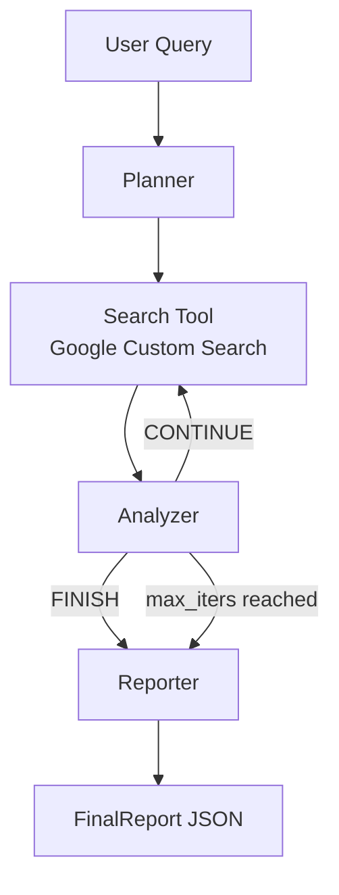
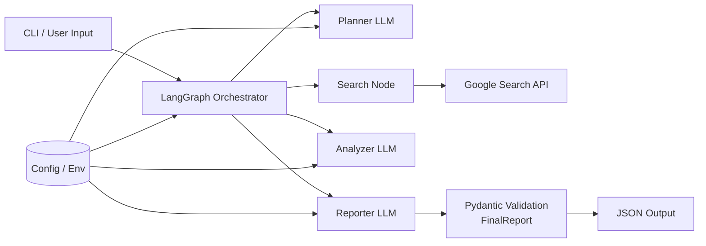

# Sentinel Research Agent (SRA)

SRA converts a natural-language research question into a structured JSON report with citations.

## What It Does
- Runs a planner/search/analyzer loop to gather evidence.
- Uses Google Custom Search for external sources.
- Produces a validated `FinalReport` object (topic, executive summary, sections, sources).
- Prints final report JSON to stdout via CLI.

## Quick Start

### 1. Install
```bash
python -m venv .venv
source .venv/bin/activate
pip install -e .
```

### 2. Configure Environment
OpenRouter is the default provider.

```bash
export LLM_API_KEY=...
export LLM_MODEL=google/gemini-2.5-flash
export LLM_BASE_URL=https://openrouter.ai/api/v1

export GOOGLE_SEARCH_API_KEY=...
export GOOGLE_SEARCH_ENGINE_ID=...
```

You can also place these values in `.env`.

### 3. Run
Both forms are supported:

```bash
sra "How is the EU regulating frontier AI safety tests?"
```

```bash
sra run "How is the EU regulating frontier AI safety tests?"
```

Control loop depth:

```bash
sra run "query" --max-iters 4
```

## CLI Reference

```bash
sra --help
```

Key option:
- `--max-iters`: maximum search/analyzer loop count before forced finish.

## Workflow Diagram



## Architecture Diagram



## Runtime Architecture

### Core Components
- `LangGraph`: stateful orchestration and conditional routing.
- `AgentState` (`TypedDict`): shared state across nodes.
- `LangChain + OpenAI-compatible chat client`: planner, analyzer, reporter calls.
- `Pydantic v2`: validates search inputs and final output schema.
- `Google Custom Search`: retrieval layer for web evidence.

### Node Responsibilities
- `planner`: proposes next query, `num_results`, optional `freshness`.
- `search_tool`: fetches and normalizes search hits; assigns source IDs.
- `analyzer`: decides `CONTINUE` vs `FINISH`; can update next query settings.
- `reporter`: builds `FinalReport` from accumulated context.

## Data Contracts

### Search Input
- `query: str`
- `num_results: int` (1..10)
- `freshness: str | None`

### Final Output (`FinalReport`)
- `topic: str`
- `executive_summary: str`
- `sections: List[ReportSection]`
- `sources: List[Source]`

## Practical Use Case

### Policy/Compliance Research
Input:
- "What changed in frontier AI safety requirements across EU, UK, and US in the last 12 months?"

Output:
- Executive summary for leadership.
- Sectioned findings by jurisdiction.
- Source list with links for review/audit.

## Provider Notes

### Default (GitHub-friendly): OpenRouter
- Keep OpenRouter defaults in docs and examples.
- `LLM_*` variables are recommended. Legacy `OPENROUTER_*` variables are still supported for compatibility.

### Local Alternative: Venice
If you use Venice locally, set:

```bash
export LLM_BASE_URL=https://api.venice.ai/api/v1
export LLM_MODEL=venice:uncensored
export LLM_API_KEY=...
```

## Troubleshooting

- `401 User not found`:
  - API key is invalid for the selected provider.
- `404 model unavailable`:
  - model ID is not available on that provider.
- `429 rate-limited`:
  - free-tier/provider limit hit; retry or switch model/provider.
- `OPENROUTER_MODEL='openrouter/free' is not a concrete model id`:
  - set an explicit model ID.
- Recursion limit errors:
  - increase `--max-iters` or rerun (CLI already applies a safe recursion limit multiplier).

## Project Layout

- `src/sra/cli.py`: CLI entrypoint.
- `src/sra/config.py`: env/config loading.
- `src/sra/graph.py`: LangGraph workflow and node logic.
- `src/sra/tools.py`: Google search integration.
- `src/sra/schemas.py`: Pydantic schemas.
- `src/sra/state.py`: shared agent state definition.
