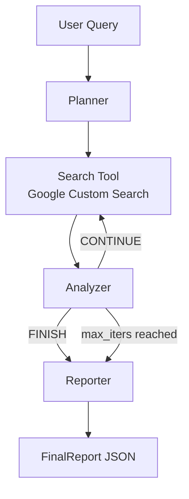
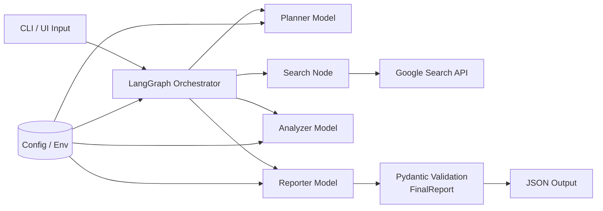
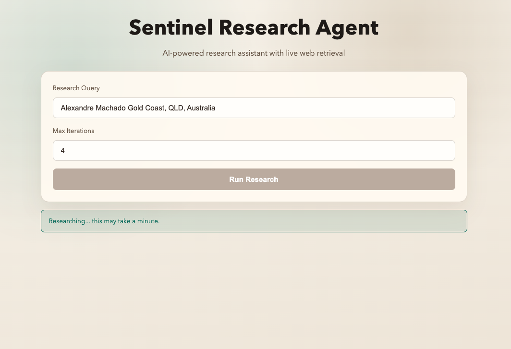

# Sentinel Research Agent (SRA)

## Why This Exists

This project explores how AI-assisted workflows and orchestration systems can automate repetitive research and operational tasks using structured multi-step processes.

SRA takes a natural-language question, runs an iterative research workflow, and returns a validated JSON report with sources. The focus is workflow design, orchestration reliability, and structured outputs that can plug into downstream operational tooling.

## Workflow At a Glance





## UI Preview

### Research In Progress


### Completed Report


## What It Does

- Runs a planner/search/analyzer loop to gather evidence.
- Uses Google Custom Search for external retrieval.
- Produces a validated `FinalReport` object (`topic`, `executive_summary`, `sections`, `sources`).
- Supports CLI and web UI execution paths.

## Practical Use Cases

- Lead qualification research before sales outreach.
- Research automation for market, policy, and competitor scans.
- Internal reporting briefs with source-linked summaries.
- Workflow routing inputs for downstream automation.
- CRM enrichment support using externally sourced context.
- Operational dashboards fed by structured JSON outputs.

## Current Limitations

This project is experimental and currently focused on orchestration logic and workflow design rather than production deployment.

- Depends on third-party model and search APIs, so latency and availability vary.
- Retrieval quality depends on search index coverage and ranking.
- Structured output fallbacks are robust but still model-behavior dependent.
- No built-in persistence, job queueing, or multi-user auth layer.
- Not tuned yet for high-throughput production workloads.

## Quick Start

### 1. Install
```bash
python -m venv .venv
source .venv/bin/activate
pip install -e .
```

### 2. Configure Environment
OpenRouter is the default provider.

```bash
export LLM_API_KEY=...
export LLM_MODEL=google/gemini-2.5-flash
export LLM_BASE_URL=https://openrouter.ai/api/v1

export GOOGLE_SEARCH_API_KEY=...
export GOOGLE_SEARCH_ENGINE_ID=...
```

You can also place these values in `.env`.

### 3. Run
Both forms are supported:

```bash
sra "How is the EU regulating frontier AI safety tests?"
```

```bash
sra run "How is the EU regulating frontier AI safety tests?"
```

Control loop depth:

```bash
sra run "query" --max-iters 4
```

Run the web UI:

```bash
sra ui --host 127.0.0.1 --port 8000
```

## Terminal Example

```bash
sra run "What changed in frontier AI safety requirements across EU, UK, and US in the last 12 months?" --max-iters 2
```

Expected output shape:

```json
{
  "topic": "...",
  "executive_summary": "...",
  "sections": [
    {
      "section_title": "...",
      "content": "...",
      "citations": ["S1", "S2"]
    }
  ],
  "sources": [
    {
      "id": "S1",
      "title": "...",
      "url": "..."
    }
  ]
}
```

## Runtime Architecture

### Core Components
- `LangGraph`: stateful orchestration and conditional routing.
- `AgentState` (`TypedDict`): shared state across workflow nodes.
- `LangChain + OpenAI-compatible chat client`: planner, analyzer, reporter calls.
- `Pydantic v2`: schema validation for planner input and final output.
- `Google Custom Search`: retrieval layer for web evidence.

### Node Responsibilities
- `planner`: proposes next query, `num_results`, and optional freshness.
- `search_tool`: fetches and normalizes hits; deduplicates and appends context.
- `analyzer`: decides `CONTINUE` or `FINISH`; can adjust follow-up retrieval.
- `reporter`: composes the final structured report.

## Data Contracts

### Search Input
- `query: str`
- `num_results: int` (1..10)
- `freshness: str | None`

### Final Output (`FinalReport`)
- `topic: str`
- `executive_summary: str`
- `sections: List[ReportSection]`
- `sources: List[Source]`

## Provider Notes

### Default: OpenRouter
- `LLM_*` variables are recommended.
- Legacy `OPENROUTER_*` variables are still supported for compatibility.

### Optional Local Alternative: Venice
```bash
export LLM_BASE_URL=https://api.venice.ai/api/v1
export LLM_MODEL=venice:uncensored
export LLM_API_KEY=...
```

## Troubleshooting

- `401` auth failure:
  - API key is invalid for the selected provider.
- `404` model unavailable:
  - Model ID is not available on that provider.
- `429` throttling:
  - Provider rate limit hit; retry or switch model/provider.
- `OPENROUTER_MODEL='openrouter/free' is not a concrete model id`:
  - Set an explicit model ID.
- Recursion limit errors:
  - Increase `--max-iters` or rerun (CLI applies a safe recursion multiplier).

## What I Learned

- Prompt reliability requires deterministic fallbacks when models ignore strict schema output.
- Orchestration complexity grows quickly when loop control, stopping conditions, and retries interact.
- Structured validation is essential for turning model output into operationally useful JSON.
- External API constraints (auth, rate limits, model availability) must be handled explicitly at the edges.
- Retrieval and summarization quality are bottlenecks that need iterative tuning and evaluation.

## Project Layout

- `src/sra/cli.py`: CLI and UI startup commands.
- `src/sra/server.py`: FastAPI UI backend and `/api/run` endpoint.
- `src/sra/config.py`: environment parsing and provider validation.
- `src/sra/graph.py`: LangGraph workflow and node logic.
- `src/sra/tools.py`: Google search integration and retry logic.
- `src/sra/schemas.py`: Pydantic data models.
- `src/sra/state.py`: shared graph state definition.
